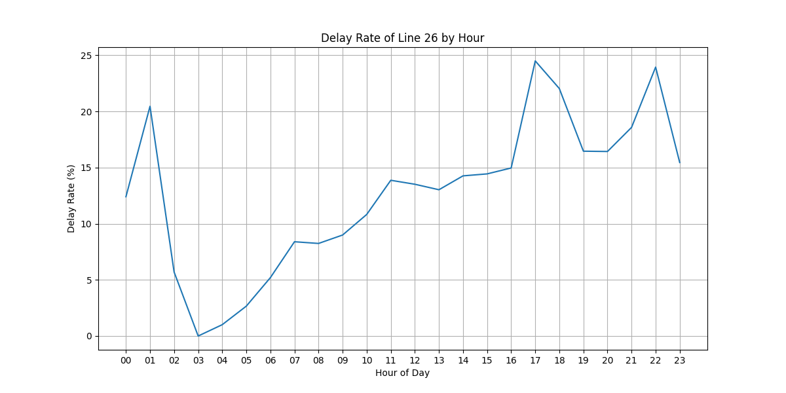
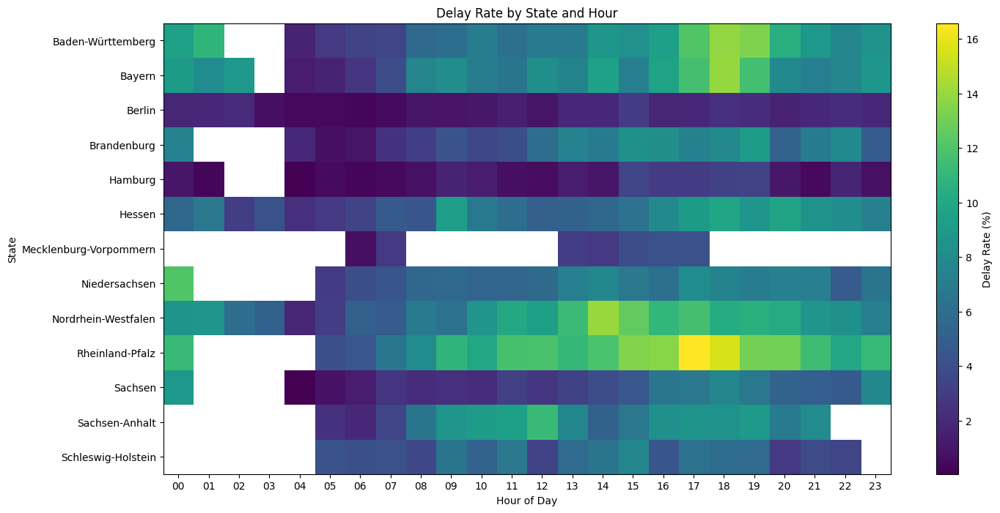

# German Train Delay Analysis

An exploratory data analysis project investigating delay patterns in German railway traffic using SQL, Python, and interactive visualizations.

---

## Project Goal

The goal of this project was to explore delay patterns in German railway traffic and identify:
- regions with elevated delay rates,
- problematic train lines,
- rush-hour escalation effects,
- and geographic delay hotspots.

Special focus was placed on investigative analysis and visual storytelling.

---

## Technologies Used

- SQL (SQLite)
- Python
- pandas
- matplotlib
- Plotly
- Jupyter Notebook
- VS Code

---

## Dataset

The dataset contains German railway stop data, including:
- arrival and departure delays,
- train lines,
- stations,
- timestamps,
- and geographic coordinates.

Note: The raw CSV file and SQLite database are not included in this repository due to GitHub file size limits. The dataset can be downloaded from Kaggle and imported locally.

Source:
[Kaggle - Deutsche Bahn Delays Dataset](https://www.kaggle.com/datasets/nokkyu/deutsche-bahn-db-delays)

---

## Project Structure

```text
german-train-delay-analysis/
│
├── database/
│   └── train_delay.db
│
├── sql/
│   └── 01_data_exploration.sql
│
├── notebooks/
│   └── 01_visualization.ipynb
│
├── visuals/
│
├── README.md
└── .gitignore
```

---

## Key Insights

### 1. Rheinland-Pfalz showed unusually high delay rates
The analysis revealed that Rheinland-Pfalz consistently displayed elevated delay rates compared to many other German states.

### 2. Line 26 emerged as a major problem corridor
Further investigation identified train line 26 as one of the most delay-prone lines in the dataset.

### 3. Delays escalated strongly during evening rush hours
Delay rates increased significantly during afternoon and evening hours, peaking around 17:00–18:00.

### 4. Geographic hotspot clusters appeared along the Rhine corridor
Interactive map analysis revealed strong delay clusters around:
- Cologne,
- Bonn,
- Koblenz,
- Bingen,
- and Mainz.

---

## Visualizations

### Delay Rate of Line 26 by Hour



---

### Delay Rate by State and Hour



---

### Interactive Delay Hotspot Map

An interactive Plotly map showing geographic delay hotspots along the Rhine corridor.

[Open Interactive Map](https://jjohn-data.github.io/german-train-delay-analysis/visuals/line26_delay_hotspots_map.html)

---

## Future Improvements

Possible future extensions:
- interactive dashboards,
- predictive delay modeling,
- deeper network analysis,
- and real-time railway monitoring.
