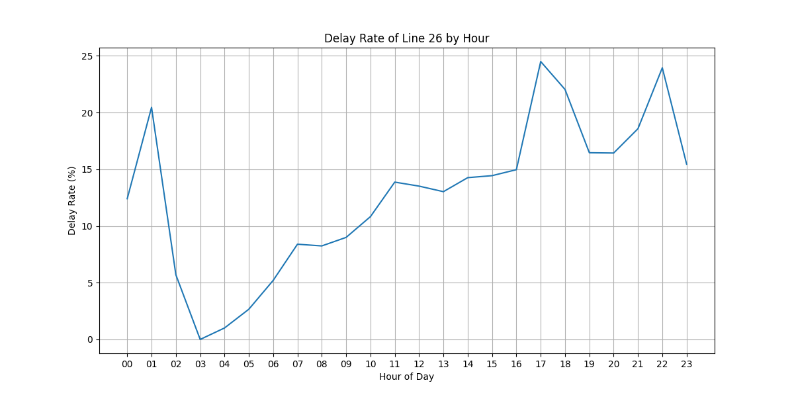
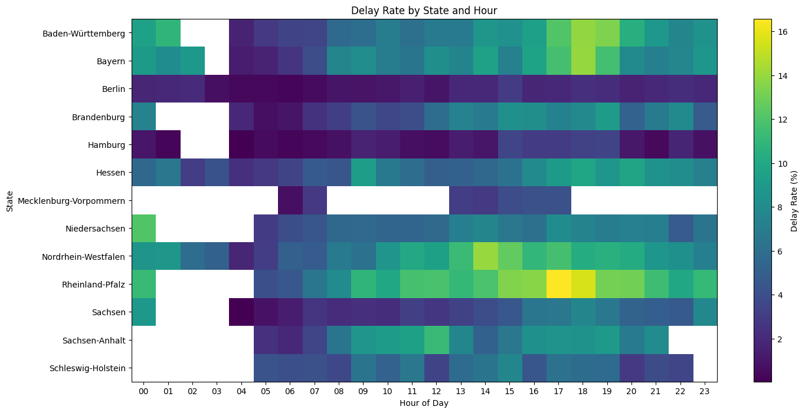

# German Train Delay Analysis

An exploratory data-analysis project investigating delay patterns in German railway stop data using SQL, Python, SQLite, and interactive visualization.

## Project Goal

The project examines four questions:

1. Which regions in the dataset have elevated arrival-delay rates?
2. Which train lines show unusually high delay rates?
3. How do delays vary over the course of the day?
4. Where do geographic delay hotspots appear for a selected high-delay line?

The project combines SQL-based exploration with Python visualizations and an interactive geographic map.

## Technologies

- SQL / SQLite
- Python
- pandas
- matplotlib
- Plotly
- Jupyter Notebook

## Dataset

The analysis uses the public **Deutsche Bahn Delays Dataset** available on Kaggle:

[Kaggle – Deutsche Bahn Delays Dataset](https://www.kaggle.com/datasets/nokkyu/deutsche-bahn-db-delays)

The data contains railway-stop observations including planned arrival times, arrival delays, train lines, stations, states, and geographic coordinates.

The raw CSV and generated SQLite database are intentionally excluded from GitHub because of their size.

### Delay definition

Throughout this project, a stop is classified as **delayed when `arrival_delay_m >= 6`**.

Rows with missing arrival-delay values are excluded from delay-rate calculations.

This is an analytical threshold used consistently throughout the project; results should therefore be interpreted relative to this definition.

## Reproducible Setup

### 1. Clone the repository

```bash
git clone https://github.com/jjohn-data/german-train-delay-analysis.git
cd german-train-delay-analysis
```

### 2. Install dependencies

```bash
python -m pip install -r requirements.txt
```

### 3. Download the dataset

Download the dataset from Kaggle and create the local data folder:

```text
data/
└── <downloaded-dataset>.csv
```

Keep a single source CSV in the `data/` directory.

### 4. Build the SQLite database

```bash
python scripts/build_database.py
```

The script:

- detects the CSV in `data/`,
- validates the columns required by this project,
- creates `database/train_delay.db`,
- imports the data into the `train_data` table,
- and creates indexes used by the analysis.

### 5. Run the analysis

SQL exploration:

```text
sql/01_data_exploration.sql
```

Python visualization:

```text
notebooks/01_visualization.ipynb
```

The notebook can be launched either from the repository root or from the `notebooks/` directory.

## Analytical Workflow

### SQL exploration

The SQL analysis covers:

- dataset size and time range,
- basic delay KPIs,
- station-level delay rates,
- hourly and weekday patterns,
- delay categories,
- train-line comparisons,
- state-level comparisons,
- and deeper investigation of line 26.

Minimum-observation thresholds are used in several ranking queries to avoid highlighting categories based on very small samples.

### Python visualization

The notebook queries the same SQLite database and produces:

- hourly delay-rate profile for line 26,
- state-by-hour delay heatmap,
- interactive geographic hotspot map.

## Key Findings

### Rheinland-Pfalz showed elevated delay rates

Within the analyzed dataset, Rheinland-Pfalz appeared among the states with comparatively high arrival-delay rates.

### Line 26 was a high-delay line in the dataset

The SQL exploration identified line 26 as a useful case for deeper investigation because of its comparatively high delay rate and sufficient number of observations.

### Line 26 delays increased strongly in the late afternoon

For line 26, the hourly analysis shows a pronounced increase in delay rate around 17:00–18:00 in the analyzed observations.

### Geographic hotspots appear along the Rhine corridor

The interactive line-26 analysis highlights clusters around locations including Cologne, Bonn, Koblenz, Bingen, and Mainz.

These findings describe patterns in the dataset and do not by themselves establish the operational causes of the delays.

## Visualizations

### Delay Rate of Line 26 by Hour



### Delay Rate by State and Hour



### Interactive Delay Hotspot Map

[Open Interactive Map](https://jjohn-data.github.io/german-train-delay-analysis/visuals/line26_delay_hotspots_map.html)

The HTML visualization is generated from the notebook using Plotly.

## Project Structure

```text
german-train-delay-analysis/
├── notebooks/
│   └── 01_visualization.ipynb
├── scripts/
│   └── build_database.py
├── sql/
│   └── 01_data_exploration.sql
├── visuals/
│   ├── delay_rate_by_state_and_hour.png
│   ├── line26_delay_hotspots_map.html
│   └── line26_delay_rate_by_hour.png
├── .gitignore
├── requirements.txt
└── README.md
```

Local files created during setup:

```text
data/
└── <dataset>.csv

database/
└── train_delay.db
```

These large files are ignored by Git.

## Limitations

- The analysis is observational and descriptive; it does not identify causal reasons for delays.
- Results depend on the time period and coverage of the downloaded dataset.
- A railway stop is the unit of analysis, so results should not automatically be interpreted as unique-train or passenger-level statistics.
- The six-minute delay threshold is a project definition and directly affects all reported delay rates.
- Lines, stations, and regions with more observations can dominate absolute delay counts; rate comparisons therefore use observation thresholds where appropriate.
- Geographic hotspot analysis identifies spatial patterns, not underlying infrastructure or operational causes.

## Possible Extensions

- compare arrival and departure delays,
- analyze delay distributions rather than only threshold rates,
- add confidence intervals or uncertainty estimates for group comparisons,
- investigate route/network effects,
- build a Power BI or interactive analytical dashboard,
- develop predictive models only after establishing an appropriate train/test design and leakage checks.
